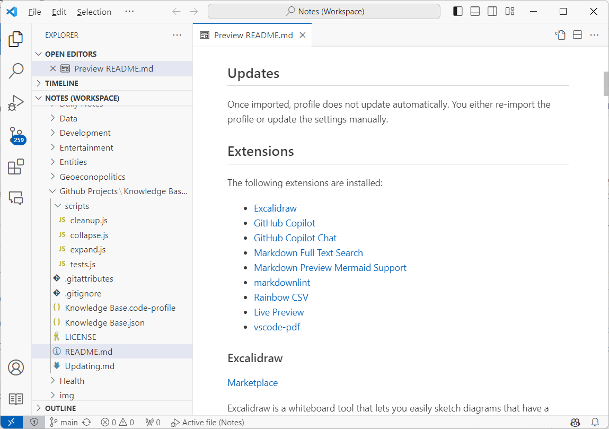

# Knowledge Base Profile

Knowledge Base Profile is a Visual Studio Code profile (settings, extensions and their configurations) for knowledge management.

In this profile, editor and plugins are configured to increase productivity of organizing, adding, transformting, and searching information.

The core concepts of this profile are:

- the knowledge base is organised as articles in a folder hierarchy
- each article is a Markdown file
- articles are linked to each other using markdown links
- articles are atomic, self-contained, and short

The Visual Studio Code configuration concepts:

- the Markdown settings are configured to be compatible with other knowledge management tools
- UI is configured to be minimalistic and distraction-free
- extensions for visualising and searching the knowledge base are installed



## Installation

1. Download the profile to a file, e.g. `Knowledge Base.code-profile`
2. Import the profile in your local Visual Studio Code

## Updates

Once imported, profile does not update automatically. You either re-import the profile or update the settings manually.

## Extensions

The following extensions are installed:

- [Excalidraw](#excalidraw)
- [GitHub Copilot](#github-copilot)
- [GitHub Copilot Chat](#github-copilot-chat)
- [Markdown Full Text Search](#markdown-full-text-search)
- [Markdown Preview Mermaid Support](#markdown-preview-mermaid-support)
- [markdownlint](#markdownlint)
- [Rainbow CSV](#rainbow-csv)
- [Live Preview](#live-preview)
- [vscode-pdf](#vscode-pdf)

### Excalidraw

[Marketplace](<https://marketplace.visualstudio.com/items?itemName=pomdtr.excalidraw-editor>)

Excalidraw is a whiteboard tool that lets you easily sketch diagrams that have a hand-drawn feel to them.

### GitHub Copilot

[Marketplace](<https://marketplace.visualstudio.com/items?itemName=GitHub.copilot>)

GitHub Copilot is an AI pair programmer that helps you write code faster and with less work.

### GitHub Copilot Chat

[Marketplace](<https://marketplace.visualstudio.com/items?itemName=GitHub.copilot-chat>)

Allows you to chat with GitHub Copilot.

### Markdown Full Text Search

[Marketplace](<https://marketplace.visualstudio.com/items?itemName=AlexandriteSoftware.markdown-search>)

Allows you to search for text in Markdown files.

### Markdown Preview Mermaid Support

[Marketplace](<https://marketplace.visualstudio.com/items?itemName=bierner.markdown-mermaid>)

Adds Mermaid diagram and flowchart support to VS Code's builtin markdown preview.

### markdownlint

[Marketplace](<https://marketplace.visualstudio.com/items?itemName=DavidAnson.vscode-markdownlint>)

Markdown linting and style checking.

### Rainbow CSV

[Marketplace](<https://marketplace.visualstudio.com/items?itemName=mechatroner.rainbow-csv>)

Highlight columns in CSV and TSV files.

### Live Preview

[Marketplace](<https://marketplace.visualstudio.com/items?itemName=ms-vscode.live-server>)

Launch a development local Server with live reload feature for static & dynamic pages.

### vscode-pdf

[Marketplace](<https://marketplace.visualstudio.com/items?itemName=tomoki1207.pdf>)

Enables viewing PDF files.

## Settings

The following settings are configured:

- [Breadcrumbs](#breadcrumbs)
- [Diff Editor: Ignore Trim Whitespace](#diff-editor-ignore-trim-whitespace)
- [Editor: Font Ligatures](#editor-font-ligatures)
- [Editor: Inline Suggest](#editor-inline-suggest)
- [Editor: Glyph Margin](#editor-glyph-margin)
- [Editor: Minimap](#editor-minimap)
- [Editor: Paste As](#editor-paste-as)
- [Editor: Render Whitespace](#editor-render-whitespace)
- [Editor: Tab Size](#editor-tab-size)
- [Explorer Decorations: Badges](#explorer-decorations-badges)
- [Explorer Decorations: Colors](#explorer-decorations-colors)
- [Files: Auto Save](#files-auto-save)
- [GitHub Copilot: Enable](#github-copilot-enable)
- [Markdown: Editor: File Paste](#markdown-editor-file-paste)
- [Markdown: Preferred Md Path Extension Style](#markdown-preferred-md-path-extension-style)
- [Markdown: Preview: Breaks](#markdown-preview-breaks)
- [Markdown: Update Links On File Move](#markdown-update-links-on-file-move)
- [Markdown: Validate](#markdown-validate)
- [Window: Command Center](#window-command-center)
- [Window: Title Bar Style](#window-title-bar-style)
- [Workbench: Editor: Empty Hint](#workbench-editor-empty-hint)
- [Workbench: Editor: Untitled: Label Format](#workbench-editor-untitled-label-format)
- [Workbench: Color Theme](#workbench-color-theme)
- [Workbench: Startup Editor](#workbench-startup-editor)
- [Language settings for Markdown: Editor: Word Based Suggestions](#language-settings-for-markdown-editor-word-based-suggestions)

JSON summary of the settings:

```json
{
  "breadcrumbs.enabled": false,
  "diffEditor.ignoreTrimWhitespace": true,
  "editor.fontLigatures": true,
  "editor.inlineSuggest.enabled": true,
  "editor.glyphMargin": false,
  "editor.minimap.enabled": false,
  "editor.pasteAs.enabled": true,
  "editor.renderWhitespace": "none",
  "editor.tabSize": 4,
  "explorer.decorations.badges": false,
  "explorer.decorations.colors": false,
  "files.autoSave": "afterDelay",
  "github.copilot.enable": {
    "*": true,
    "plaintext": true,
    "markdown": true,
    "scminput": true
  },
  "markdown.editor.filePaste.enabled": true,
  "markdown.preferredMdPathExtensionStyle": "removeExtension",
  "markdown.preview.breaks": true,
  "markdown.updateLinksOnFileMove.enabled": "always",
  "markdown.updateLinksOnFileMove.include": [ "**/*.*" ],
  "markdown.validate.enabled": true,
  "window.commandCenter": true,
  "window.titleBarStyle": "custom",
  "workbench.editor.empty.hint": "hidden",
  "workbench.editor.untitled.labelFormat": "content",
  "workbench.colorTheme": "Default Light Modern",
  "workbench.startupEditor": "none",
  "[markdown]": {
    "editor.wordBasedSuggestions": false
  }
}
```

### Breadcrumbs

```json
{ "breadcrumbs.enabled": false }
```

Breadcrumbs are disabled to reduce visual clutter. Hierarchy of the article is visible in the Explorer and the Outline panels.

### Diff Editor: Ignore Trim Whitespace

```json
{ "diffEditor.ignoreTrimWhitespace": true }
```

Whitespace changes are ignored in the Diff Editor, which simplifies comparing articles.

This change does not affect version control diffs, e.g. git's diff.

### Editor: Font Ligatures

```json
{ "editor.fontLigatures": true }
```

Font ligatures (combining multiple characters into one) are enabled to improve readability.

### Editor: Inline Suggest

```json
{ "editor.inlineSuggest.enabled": true }
```

Show inline suggestions automatically.

### Editor: Glyph Margin

```json
{ "editor.glyphMargin": false }
```

Glyph margin is disabled to reduce visual clutter.

### Editor: Minimap

```json
{ "editor.minimap.enabled": false }
```

Minimap is disabled. It is expected that the most of the articles are short enough to fit in one screen.

### Editor: Paste As

```json
{ "editor.pasteAs.enabled": true }
```

Paste as Markdown is enabled to simplify adding links and images to the articles.

### Editor: Render Whitespace

```json
{ "editor.renderWhitespace": "none" }
```

Whitespace is not rendered to reduce visual clutter.

### Editor: Tab Size

```json
{ "editor.tabSize": 4 }
```

Standard indentation for Markdown files is 4 spaces. See: <https://spec.commonmark.org/current/>.

### Explorer Decorations: Badges

```json
{ "explorer.decorations.badges": false }
```

Badges are disabled to reduce visual clutter.

### Explorer Decorations: Colors

```json
{ "explorer.decorations.colors": false }
```

Coloring the decirations are disabled to reduce visual clutter.

### Files: Auto Save

```json
{ "files.autoSave": "afterDelay" }
```

Files are saved automatically after a second from the last change.

### GitHub Copilot: Enable

```json
{
  "github.copilot.enable": {
    "*": true,
    "plaintext": true,
    "markdown": true,
    "scminput": true
  }
}
```

Enable GitHub Copilot for all types of input, including plain text, Markdown, and Source Control Management input.

### Markdown: Editor: File Paste

```json
{ "markdown.editor.filePaste.enabled": true }
```

Pasting files provides option to create Markdown links and images.

### Markdown: Preferred Md Path Extension Style

```json
{ "markdown.preferredMdPathExtensionStyle": "removeExtension" }
```

The `.md`` extension for links to Markdown documents is removed to simplify the links.

### Markdown: Preview: Breaks

```json
{ "markdown.preview.breaks": true }
```

Line breaks are rendered as `<br>` tags. This is to achive compatibility with Obsidian and other Markdown editors.

### Markdown: Update Links On File Move

```json
{ "markdown.updateLinksOnFileMove.enabled": "always",
  "markdown.updateLinksOnFileMove.include": [ "**/*.*" ] }
```

Links are updated automatically when files are moved.

### Markdown: Validate

```json
{ "markdown.validate.enabled": true }
```

Markdown files are validated and errors are reported.

### Window: Command Center

```json
{ "window.commandCenter": true }
```

Shows command Launcher together with window title.

### Window: Title Bar Style

```json
{ "window.titleBarStyle": "custom" }
```

Title bar is customised, enables showing the command Launcher.

### Workbench: Editor: Empty Hint

```json
{ "workbench.editor.empty.hint": "hidden" }
```

Hides the empty editor text.

### Workbench: Editor: Untitled: Label Format

```json
{ "workbench.editor.untitled.labelFormat": "content" }
```

Names the untitled editor tabs by the content of the editor.

### Workbench: Color Theme

```json
{ "workbench.colorTheme": "Default Light Modern" }
```

The default light theme. This is higly subjective, but our research shows that light themes are better for working with information (e.g. reading and writing) in contrast to dark themes that are better for working with code (e.g. debugging).

### Workbench: Startup Editor

```json
{ "workbench.startupEditor": "none" }
```

Restore the last opened editors on startup.

### Language settings for Markdown: Editor: Word Based Suggestions

```json
{ "[markdown]": {
    "editor.wordBasedSuggestions": false
  }
}
```

Completing the current word in the document does not make much sense for free-form text like Markdown.
